# Hi, I'm Stephen 🗿

**AI/ML Engineer**

I’m an engineer focused on the intersection of Machine Learning and scalable software. I build systems that solve problems—sometimes with AI, sometimes with just good logic.

- 📚 **Learning about:** Agents, MCP servers and Multi-Agent systems
- 🛠️ **Building:** LLM-powered applications and RAG pipelines (FinQuery).
- ⚙️ **Focus:** MLOps, PyTorch, and deploying models that actually work.
- 📍 Based in Lagos, Nigeria.

[LinkedIn](https://www.linkedin.com/in/stephen-adegbokun/) | [Portfolio](https://datalordstephen.github.io/)

### Skills

### Badges

<b>My GitHub Stats</b>

